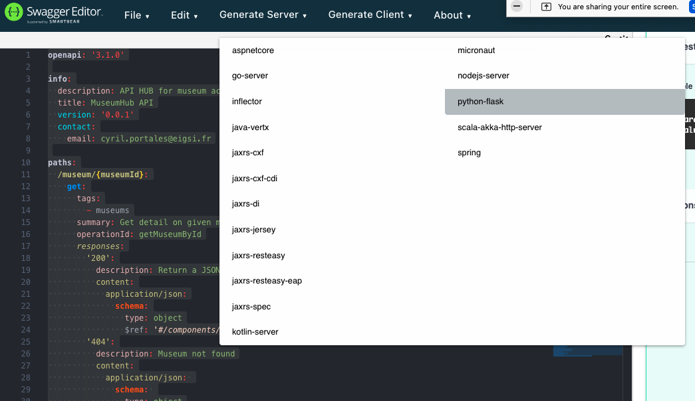

 # tp-api

# Resources

- Best practices:	https://learn.microsoft.com/en-us/azure/architecture/best-practices/api-design
- Samples:	https://restfulapi.net/http-methods/
- HTTP	Codes: https://developer.mozilla.org/en-US/docs/Web/HTTP/Status

# Architecture overview

Goal is to create a Hub API to access to others museums API. This hub will be a backend application that expose an API and make the usage of other API easier. First musuem is the Metropolitan of Art Museum API.

The global architecture of the application is:


A request from a client application should be:

> Client application -- HTTP REQUESTS --> YOUR NEW API --- HTTP REQUESTS ---> One of the targeted museum

# Goal overview

Across this tuturial, goals are:

* Think your API (TP 1 with excel or google sheet)
* Design "YOUR NEW API" (TP 2 with Swagger Editor)
* Create a Python or PHP application and code the API you have just defined
* Add to your application requests to call the museum API

# Materials

- Google sheet
- The Swagger editor at https://editor.swagger.io
- The metropolitan of Art Museum API documentation:  https://metmuseum.github.io
- Python or PHP on your computer
 
# TP 1: Think the API

Create a Google Sheet or Excel to define what your API is able to do (how are requests and response).

You must provide a proposal for the API which is able to make call across museums. 

Enpoints to define are:

| Endpoints | Description | Possible operations |
|-----------|-------------|-----------|
| /search | look for object in museums with criteria and filters | Search (Read) |
| /museums | get info on museum, list existing museum | List (Read), Get one (Read) |
| /config | get server config parameters. A parameter is a key with a value (key=value) (e.g default_page=3) | List all (Read), Get one (Read), Update one (Update)  |


## Tips

- request must have a parameter to identify the museum (a code or unique id)
- request must have parameters to limit the number of result and browse into result pages (offest and limit)
- response should be the same, whatever your API result is
- response should contains error if something goes wrong
- When you define an API, You have to create objects to contains request and/or response data

# TP 2: Design the API with Swagger

- Go on https://editor-next.swagger.io
- Click on "Edit" menu and "Clear"
- Open another tab with the editor to have a sample code

Export YAML in a file, name this file with [your login].yaml and put your YAML Result in https://drive.google.com/drive/folders/1UlY8qus8aM0_-FJgHw4IzQPt4bdRzcC9?usp=sharing
## Tips

- You will define an "openapi" API
- The editor will help you to fill the file but not in all situation
- Also, you will have quick fix proposal and error message that you should follow
- Take time to analyze the sample code

If you are really spunky, you can use directly the specifications at: https://github.com/OAI/OpenAPI-Specification/blob/main/versions/3.1.0.md

# TP 3: Create an application

## Install Python Flask

Follow instructions : https://flask.palletsprojects.com/en/3.0.x/installation/

We suggest to use dotenv (.env) to avoid to break you Python version but it's not mandatory

Quick install for venv is:

```Shell
mkdir myproject
cd myproject
python3 -m venv .venv
. .venv/bin/activate
```

You can install directly Flask:

```Shell
pip3 install flask
```

When python venv and flask are installed, you can you dotenv ( .env file), it's a way to infject environment variable in your program. Follow this: https://github.com/theskumar/python-dotenv#readme

```Shell
pip3 install dotenv
```

See the link for usage


## Make your first API application with flask

Follow the quick start to discover flask. You don't need to do all sample. When you understand, keep this page as a documentation for help and go to create your API

https://flask.palletsprojects.com/en/3.0.x/quickstart/


## Generate the code with Swagger (deprecated)

Click on "Generate Server" and choose "Python-flask"



## Test your application with POSTMAN

## Add requests to the museum
